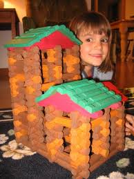

**3-D IQ a Sign of Genius?**

****

Researchers have found that a gift for spatial reasoning might be a strong indicator of future innovative thinking—better, perhaps, than math or language skills.

Children who tinker, put things together, and take things apart are expressing a type of ingenuity unable to be measured with tests like the SAT and ACT. The study suggests high spatial reasoning skills leads to success in careers such as engineering, technology, or, one easily imagines, sculpting—like the kinetic work of Alexander Calder (above). 

*—Diane Richard, writer*

*July 17*

****

Source: Douglas Quenqua, *New York Times*, July 15, 2013 

