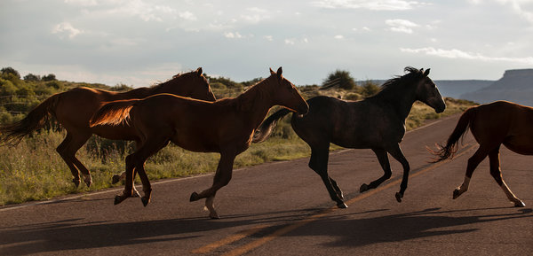

**Pastoral—or Pests?**

****

Those thousands of wild horses? They’re running amok. And conservationists like Robert Redford are bumping heads with the Navajo Nation over what to do about it.

The feral symbols of freedom in the West are ranging roughshod through Native lands, causing \$200,000 a year in damage, and dying of starvation and thirst. One solution is to round them up and send them to slaughter, which the Navajo Nation contends is more humane. But Redford, the Humane Society, and others argue for the creation of natural habitats and adoption.

*—Diane Richard, writer, August 14*

**

**

Photo: Diego James Robles for *The New York Times*

Source: FERNANDA SANTOS, “On Fate of Wild Horses, Stars and Indians Spar,” 

*New York Times*, August 10, 2013 

